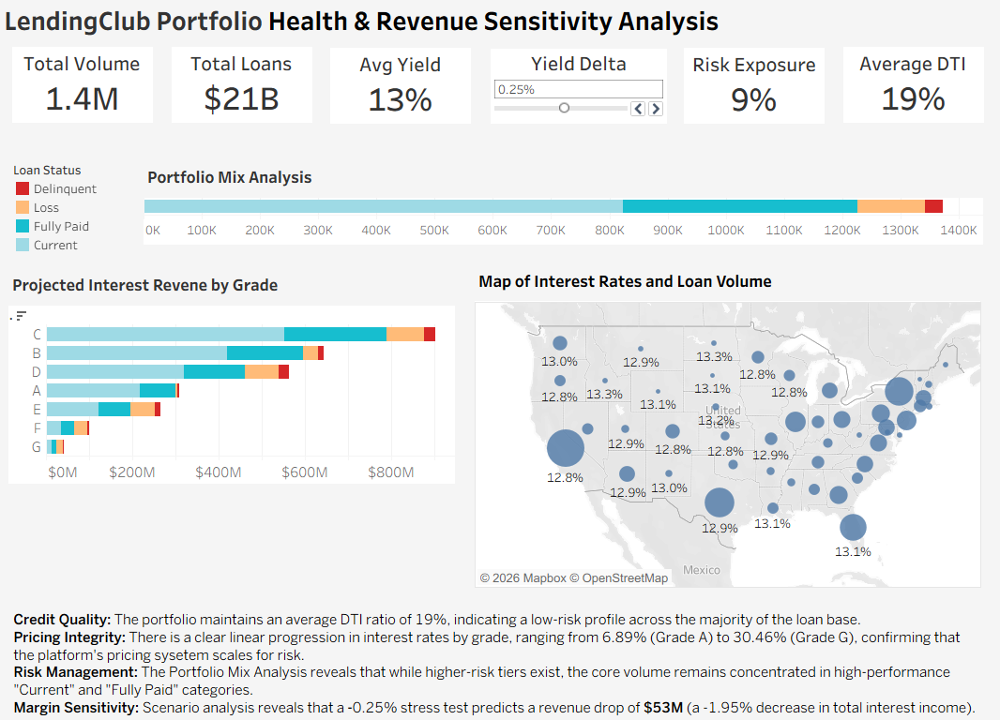

## LendingClub Credit Risk Analysis: End-to-End ETL & Predictive Modeling

1. Project Overview
- Goal: Analyze 1.4M loan records to provides a comprehensive overview of LendingClub's performance
- Dataset: LendingClub "Accepted Loans" (2007–2018).
  
1. The Data Pipeline (ETL)
- Extraction: Utilized Python pandas to process a large .csv.gz file in chunks to manage memory efficiency.
- Transformation: Filtered the dataset from 2.2M rows down to 1.37M rows, focusing on the 2016–2018 period.Loading: Automated the data transfer to SQL Server 2025 using SQLAlchemy and pyodbc.
  
3. Technical Challenges & SolutionsDriver 
   - Compatibility: Resolved Invalid precision errors by upgrading from the legacy SQL Server driver to ODBC Driver 17.
   - Memory Management: Implemented chunking ($50,000$ rows per batch) to prevent system crashes during the SQL upload.
   - Security: Configured connection strings to bypass SSL certificate issues for local development using TrustServerCertificate.

4. Data Dictionary
To ensure accurate risk modeling, the following key features were extracted from the 2.2M+ record dataset:

- `loan_amnt`: The listed amount of the loan applied for by the borrower.
- `int_rate`: Interest Rate on the loan.
- `grade`: LendingClub assigned loan grade (A–G) based on borrower creditworthiness.
- `annual_inc`: The self-reported annual income provided by the borrower during registration.
- `issue_d`: The month which the loan was funded; used to filter for the 2016–2018 portfolio.
- `loan_status`: Current status of the loan (e.g., Fully Paid, Charged Off, Current). 
- `purpose`: A category provided by the borrower for the loan request (e.g., debt consolidation, credit card).
- `state` : State where a loan was issued.
- `dti:` Debt-To-Income ratio; a ratio calculated using the borrower’s total monthly debt payments divided by their monthly income.

1. Key Data Transformations & Logic
The following logic was implemented within Tableau to transform raw loan data into actionable financial metrics:

- Yield Delta: A parameter ranging from -0.5% to 0.5% is added to the historical interest rate field.
- Projected Interest Revenue: An aggregate calculation that applies the Yield Delta-adjusted rate to the total loan principal.
- Annual Income Binning: Individual borrower incomes are grouped into standardized ranges (bins) to normalize the 1.37M record dataset.
- Loan Status Grouping: Raw status labels were consolidated into four primary categories: Current, Fully Paid, Delinquent, and Loss.
  
6. Dashboard and Summary
   
 

The dashboard serves as a comprehensive portfolio health and sensitivity analysis, integrating historical performance with predictive modeling. It begins with Portfolio Health at the top level to establish the current risk baseline (9% exposure) while the Map visualization enables a granular drill-down into geographic concentrations. The projected revenue chart allows users to observe how the portfolio’s risk profile responds to market shifts. Together, these elements create a direct visual connection between current loan health and future revenue outcomes.

Portfolio on Tableau Public: [LendingClub Portfolio Analysis](https://public.tableau.com/app/profile/keiko.shiozaki2304/viz/LendingClub_Predictive_Analysis/Executive?publish=yes)